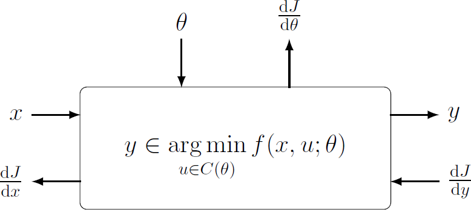

## Deep Declarative Networks
CVPR Workshop 2020, June, Seattle, Washington, USA

---

[Program](#program) |
[Invited Speakers](#invited-speakers) |
[Submission](#submission) |
[Organizers](#organizers)

Conventional deep learning architectures involve composition of simple feedforward processing functions that are explicitly defined. Recently, researchers have been exploring deep learning models with implicitly defined components. To distinguish these from conventional deep learning models we call them **deep declarative networks**, borrowing nomenclature from the programming community ([Gould et al., 2019](https://arxiv.org/abs/1607.05447)).

Processing nodes in deep declarative networks involve solving an optimization problem in the forward pass. End-to-end learning back-propagates gradients through the node, which requires the optimization problem to be differentiable. A few recent works have studied various optimization problem classes and shown how backpropagation is possible even without the knowledge of the algorithm used for solving the problem in the first place ([Agrawal et al., 2019b](http://web.stanford.edu/~boyd/papers/pdf/diff_cvxpy.pdf); [Agrawal et al., 2019a](https://web.stanford.edu/~boyd/papers/pdf/diff_cone_prog.pdf); [Amos, 2019](http://reports-archive.adm.cs.cmu.edu/anon/2019/CMU-CS-19-109.pdf); [Pfau et al. 2019](https://arxiv.org/abs/1806.02215); [Amos and Kotler, 2017](https://github.com/locuslab/optnet); [Gould et al., 2016](https://arxiv.org/abs/1607.05447)). The ideas have been applied to various problems including video classification ([Fernando and Gould, 2016](http://proceedings.mlr.press/v48/fernando16.pdf); [Cherian et al., 2017](http://openaccess.thecvf.com/content_cvpr_2017/papers/Cherian_Generalized_Rank_Pooling_CVPR_2017_paper.pdf), [Wang and Cherian, 2019](https://ieeexplore.ieee.org/document/8812898)), attribute ranking ([Santa Cruz et al., 2018](https://ieeexplore.ieee.org/document/8481554)), and meta-learning ([Lee et al., 2019](http://openaccess.thecvf.com/content_CVPR_2019/papers/Lee_Meta-Learning_With_Differentiable_Convex_Optimization_CVPR_2019_paper.pdf)).

Variants of deep declarative networks have also been studied recently such as methods for imposing hard constraints on the output of neural network models ([Neila et al., 2017](https://infoscience.epfl.ch/record/262884?ln=en)) and novel models based on back-propagating through ordinary differential equations ([Chen et al., 2018](https://papers.nips.cc/paper/7892-neural-ordinary-differential-equations.pdf)) and combinatorial submodular functions ([Tschiatschek et al., 2018](https://las.inf.ethz.ch/files/tschiatschek18submodular-diff.pdf)).

### Topics

This workshop explores the advantages (and potential shortcomings) of declarative networks and their variants, bringing ideas developed in different contexts under the umbrella of deep declarative networks. We will discuss technical issues that need to be overcome in developing such models and applications of these models to computer vision problems that show benefit over conventional approaches. Topics include:
* Declarative end-to-end learnable processing nodes
* Differentiable constrained and unconstrained (non-convex) optimization problems
* Differentiable convex optimization problems
* Imposing hard constraints in deep learning models
* Backpropagation through physical models
* Applications of above to problems in computer vision

## Program

TBA

## Invited Speakers

TBA

## Submission

Instructions coming soon...

### Important Dates (tentative)

* Submission deadline: 1 March 2020
* Author notification: 22 March 2020
* Workshop camera-ready deadline: TBA

## Organizers

<table style="text-align:center;">
  <tr>
    <td></td>
    <td></td>
    <td></td>
    <td></td>
  </tr>
  <tr>
    <td><b>Stephen Gould</b> ANU</td>
    <td><b>Anoop Cherian</b> MERL</td>
    <td><b>Dylan Campbell</b> ANU</td>
    <td><b>Richard Hartley</b> ANU</td>
  </tr>
</table>

Contact: <a href="mailto:cvpr2020@deepdeclarativenetworks.com">cvpr2020@deepdeclarativenetworks.com</a>

<link rel="stylesheet" type="text/css" href="css/bootstrap.min.css">
<link rel="stylesheet" type="text/css" href="css/main.css?1" media="screen,projection">

  

    
    

      <a href="https://cecs.anu.edu.au/people/stephen-gould/" target="_blank">Stephen Gould</a>
      ANU
    

  

  

    
    

      <a href="http://www.merl.com/people/cherian/" target="_blank">Anoop Cherian</a>
      MERL
    

  

  

    
    

      <a href="https://sites.google.com/view/djcampbell/" target="_blank">Dylan Campbell</a>
      ANU
    

  

  

    
    

      <a href="https://cecs.anu.edu.au/people/richard-hartley/" target="_blank">Richard Hartley</a>
      ANU
    

  

 

Contact: <a href="mailto:cvpr2020@deepdeclarativenetworks.com">cvpr2020@deepdeclarativenetworks.com</a>

