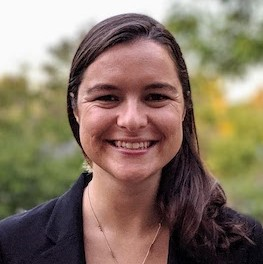

<link rel="stylesheet" type="text/css" href="css/bootstrap.min.css">
<link rel="stylesheet" type="text/css" href="css/main.css?1" media="screen,projection">

## Deep Declarative Networks
[CVPR 2020 Workshop](http://cvpr20.com/deep-declarative-networks/), 14 June, Seattle, Washington, USA

---

> :information_source: **(15 June 2020):** All recorded talks are available [here](https://www.youtube.com/playlist?list=PLD-7XrNHCcFJCxYrZQRYsTvv3mTogWiiI).

---

[Program](#program) |
[Speakers](#invited-speakers) |
[Papers](#accepted-papers) |
[Submission](#submission) |
[Dates](#important-dates) |
[Organizers](#organizers)

Conventional deep learning architectures involve composition of simple feedforward processing functions that are explicitly defined. Recently, researchers have been exploring deep learning models with implicitly defined components. To distinguish these from conventional deep learning models we call them **deep declarative networks**, borrowing nomenclature from the programming languages community ([Gould et al., 2019](https://arxiv.org/abs/1909.04866)).

Processing nodes in deep declarative networks involve solving an optimization problem in the forward pass. End-to-end learning back-propagates gradients through the node, which requires the optimization problem to be differentiable. A few recent works have studied various optimization problem classes and shown how backpropagation is possible even without the knowledge of the algorithm used for solving the problem in the first place ([Agrawal et al., 2019b](http://web.stanford.edu/~boyd/papers/pdf/diff_cvxpy.pdf); [Agrawal et al., 2019a](https://web.stanford.edu/~boyd/papers/pdf/diff_cone_prog.pdf); [Amos, 2019](http://reports-archive.adm.cs.cmu.edu/anon/2019/CMU-CS-19-109.pdf); [Pfau et al. 2019](https://arxiv.org/abs/1806.02215); [Amos and Kotler, 2017](https://github.com/locuslab/optnet); [Gould et al., 2016](https://arxiv.org/abs/1607.05447)). The ideas have been applied to various problems including video classification ([Fernando and Gould, 2016](http://proceedings.mlr.press/v48/fernando16.pdf); [Cherian et al., 2017](http://openaccess.thecvf.com/content_cvpr_2017/papers/Cherian_Generalized_Rank_Pooling_CVPR_2017_paper.pdf), [Wang and Cherian, 2019](https://ieeexplore.ieee.org/document/8812898)), attribute ranking ([Santa Cruz et al., 2018](https://ieeexplore.ieee.org/document/8481554)), meta-learning ([Lee et al., 2019](http://openaccess.thecvf.com/content_CVPR_2019/papers/Lee_Meta-Learning_With_Differentiable_Convex_Optimization_CVPR_2019_paper.pdf)), and model predictive control ([Amos et al., 2018](https://papers.nips.cc/paper/8050-differentiable-mpc-for-end-to-end-planning-and-control.pdf)).

Variants of deep declarative networks have also been studied recently such as methods for imposing hard constraints on the output of neural network models ([Neila et al., 2017](https://infoscience.epfl.ch/record/262884?ln=en)), novel models based on back-propagating through ordinary differential equations ([Chen et al., 2018](https://papers.nips.cc/paper/7892-neural-ordinary-differential-equations.pdf)), approximating maximum satisfiability (MAXSAT) problems ([Wang et al., 2019](https://arxiv.org/abs/1905.12149)), and combinatorial submodular functions ([Tschiatschek et al., 2018](https://las.inf.ethz.ch/files/tschiatschek18submodular-diff.pdf)).

### Topics

This workshop explores the advantages (and potential shortcomings) of declarative networks and their variants, bringing ideas developed in different contexts under a common umbrella. We will discuss technical issues that need to be overcome in developing such models and applications of these models to computer vision problems that show benefit over conventional approaches. Topics include:
* Declarative end-to-end learnable processing nodes
* Differentiable constrained and unconstrained (non-convex) optimization problems
* Differentiable convex optimization problems
* Imposing hard constraints in deep learning models
* Back-propagation through physical models
* Applications of the above to problems in computer vision such as differentiable rendering, differentiable 3d models, reinforcement learning, action recognition, meta-learning, etc.

## Program

The workshop is 100% virtual and will run as a 12+12 format, 9:15am (14 June) to 4:00pm (14 June) PDT and repeating 9:15pm (14 June) to 4:00am (15 June) PDT. The program includes a mix of live and pre-recorded talks, Q&A and poster sessions, and asynchronous discussion forums. Times below are given for the first instance; **add 12 hours for the repeated sessions**.

| Time (PDT) | Time (EDT) | Time (CEST) | Time (AEST) | Session |
|------------|------------|-------------|-------------|---------|
|  9:15am    | 12:15pm    |  6:15pm     |  2:15am     | [Welcome](https://youtu.be/uNQ9-HgMU_I) |
|  9:30am    | 12:30pm    |  6:30pm     |  2:30am     | [Invited talk #1 (Amos)](talk1) |
| 10:00am    |  1:00pm    |  7:00pm     |  3:00am     | [Invited talk #2 (Chen)](talk2) |
| 10:30am    |  1:30pm    |  7:30pm     |  3:30am     | [Invited talk #3 (Finn)](talk3) |
| 11:00am    |  2:00pm    |  8:00pm     |  4:00am     | Break |
| 11:15am    |  2:15pm    |  8:15pm     |  4:15am     | [Paper orals](#accepted-papers) |
| 12:30pm    |  3:30pm    |  9:30pm     |  5:30am     | [Poster session](#accepted-papers) |
|  2:00pm    |  5:00pm    | 11:00pm     |  7:00am     | [Invited talk #4 (Fua)](talk4) |
|  2:30pm    |  5:30pm    | 11:30pm     |  7:30am     | [Invited talk #5 (Maji)](talk5) |
|  3:00pm    |  6:00pm    | 12:00am     |  8:00am     | [Invited talk #6 (Kolter)](talk6) |
|  3:30pm    |  6:30pm    | 12:30am     |  8:30am     | Closing remarks |

* AEST is +1 day.

## Invited Speakers

  

    
    

      <a href="http://bamos.github.io/" target="_blank">Brandon Amos</a> 
      Facebook AI
    

   

   
   

    
    

      <a href="http://www.cs.toronto.edu/~rtqichen/" target="_blank">Ricky TQ Chen</a> 
      University of Toronto
    

  

  
  

    
    

      <a href="https://ai.stanford.edu/~cbfinn/" target="_blank">Chelsea Finn</a> 
      Stanford
    

  

  

    
    

      <a href="https://icwww.epfl.ch/~fua/" target="_blank">Pascal Fua</a> 
      EPFL
    

  
  

  

    
    

      <a href="https://people.cs.umass.edu/~smaji/" target="_blank">Subhransu Maji</a> 
      UMass Amherst
    

  
 

  

    
    

      <a href="http://zicokolter.com/" target="_blank">Zico Kolter</a> 
      CMU
    

  
 

## Accepted Papers

* Zan Gojcic, Caifa Zhou, Jan D. Wegner, Leonidas J. Guibas and Tolga Birdal, "*End-to-end globally consistent registration of multiple point clouds*". \[[pdf](papers/Gojcic_et_al_cvprw2020.pdf) \| [oral](https://youtu.be/xS1voun0rpg) \| [live Q&A](http://cvpr20.com/event/end-to-end-globally-consistent-registration-of-multiple-point-clouds-2/)\]
* Edward Grefenstette, Brandon Amos, Denis Yarats, Phu Mon Htut, Artem Molchanov, Franziska Meier, Douwe Kiela, Kyunghyun Cho and Soumith Chintala, "*`higher`: A Pytorch Meta-Learning Library*". \[[pdf](papers/Grefenstette_et_al_cvprw2020.pdf) \| [oral](https://youtu.be/0w7HG7NcvXM) \| [live Q&A](http://cvpr20.com/event/higher-a-pytorch-meta-learning-library-2/)\]
* Krishna Murthy Jatavallabhula, Ganesh Iyer, Soroush Saryazdi and Liam Paull, "*&nabla;SLAM: Automagically differentiable SLAM*". \[[pdf](papers/Murthy_et_al_cvprw2020.pdf) \| [oral](https://youtu.be/FnscjCh8cSU) \| [live Q&A](http://cvpr20.com/event/delta-slam-automagically-differentiable-slam-2/)\]
* Bashir Sadeghi, Lan Wang and Vishnu Boddeti, "*Adversarial Representation Learning With Closed-Form Solvers*". \[[pdf](papers/Bashir_et_al_cvprw2020.pdf) \| [oral](https://youtu.be/8oxKn5Fx11s) \| [live Q&A](http://cvpr20.com/event/adversarial-representation-learning-with-closed-form-solvers-2/)\]
* Matteo Toso, Neill D. F. Campbell and Chris Russell, "*Fixing Implicit Derivatives: Trust-Region Based Learning of Continuous Energy Functions (Abridged)*". \[[pdf](papers/Toso_et_al_cvprw2020.pdf) \| [oral](https://youtu.be/ZLDIrjrSmNg) \| [live Q&A](http://cvpr20.com/event/fixing-implicit-derivatives-trust-region-based-learning-of-continuous-energy-functions-abridged-2/)\]

## Submission

We invite paper submissions of up to **four (4) pages** describing work in areas related to the workshop [topics](#topics).

Accepted submissions will be presented as short orals or posters at the workshop and will appear on the workshop website. Authors will be given an opportunity to revise the submission before posting on the website. Papers should follow the CVPR formatting guidelines and emailed as a single PDF to <a href="mailto:cvpr2020@deepdeclarativenetworks.com">cvpr2020@deepdeclarativenetworks.com</a>, with subject line `Paper: <title>`. Submissions are not anonymous (and should include all authors' names and affiliations). References are to be included in the 4-page limit.

### Dual Submissions

We encourage submissions of preliminary or ongoing work. Accepted papers will not appear in the official IEEE proceedings but will be made public on this website. Relevant work that has previously been published or is to be presented at the main conference is also welcome.

### Important Dates

* Submission deadline: ~~1 March 2020~~ 20 March 2020 **(extended)**
* Author notification: 13 April 2020
* Workshop camera-ready deadline: 8 May 2020
* Workshop date: 14 June 2020

## Organizers

  

    
    

      <a href="https://cecs.anu.edu.au/people/stephen-gould/" target="_blank">Stephen Gould</a> 
      ANU
    

  

  

    
    

      <a href="http://www.merl.com/people/cherian/" target="_blank">Anoop Cherian</a> 
      MERL
    

  

  

    
    

      <a href="https://sites.google.com/view/djcampbell/" target="_blank">Dylan Campbell</a> 
      ANU
    

  

  

    
    

      <a href="https://cecs.anu.edu.au/people/richard-hartley/" target="_blank">Richard Hartley</a> 
      ANU
    

  

 

Contact: <a href="mailto:cvpr2020@deepdeclarativenetworks.com">cvpr2020@deepdeclarativenetworks.com</a>

