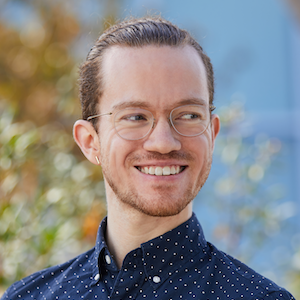

<link rel="stylesheet" type="text/css" href="css/bootstrap.min.css">
<link rel="stylesheet" type="text/css" href="css/main.css?1" media="screen,projection">

# Invited Talk: On differentiable optimization for control and vision

  

    
    

      <a href="http://bamos.github.io/" target="_blank">Brandon Amos</a> 
      Facebook AI
    

  

    
  

    Differentiable optimization enables new modeling operations to be end-to-end learned for control and vision. The first part of this talk will cover how classic operations can be interpreted as solving optimization problems so that they can be made differentiable, such as the top-k operation, which can be seen as projecting onto a polytope. We will then discuss foundational ideas and tools for unrolling through optimizers such as gradient descent and the cross-entropy method to add end-to-end learning to settings that use these optimizers. Lastly we'll discuss the objective mismatch problem in model-based control and how differentiable optimization is a potential solution to it.
  

## Video

<iframe src="https://www.youtube.com/embed/9oDXnvaT-a0" 
    width="560" 
    height="315"
    frameborder="0" 
    allowfullscreen>
</iframe>

[back](https://anucvml.github.io/ddn-cvprw2020/#program)
