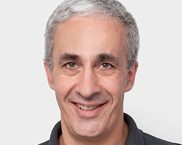

<link rel="stylesheet" type="text/css" href="css/bootstrap.min.css">
<link rel="stylesheet" type="text/css" href="css/main.css?1" media="screen,projection">

# Invited Talk: Deep Surface Meshes

  

    
    

      <a href="https://icwww.epfl.ch/~fua/" target="_blank">Pascal Fua</a> 
      EPFL
    

  

    
  

    Geometric Deep Learning has recently made striking progress with the advent of Deep Implicit Fields (SDFs). They allow for detailed modeling of watertight surfaces of arbitrary topology while not relying on a 3D Euclidean grid, resulting in a learnable 3D surface parameterization that is not limited in resolution. Unfortunately, they have not yet reached their full potential for applications that require an explicit surface representation in terms of vertices and facets because converting the SDF to such a 3D mesh representation requires a marching-cube algorithm, whose output cannot be easily differentiated with respect to the SDF parameters. In this talk, I will present several approaches to overcoming this limitation and implementing convolutional neural nets that output complex 3D surface meshes while remaining fully-differentiable and end-to-end trainable. I will also present applications of these approaches for applications such as single view reconstruction, physically-Driven Shape Optimization, and bio-medical image segmentation.
  

## Video

<iframe src="https://www.youtube.com/embed/dh5y6gSmmmc" 
    width="560" 
    height="315"
    frameborder="0" 
    allowfullscreen>
</iframe>

## Related Papers

* Udaranga Wickramasinghe, Edoardo Remelli, Graham Knott, Pascal Fua, "*Voxel2Mesh: 3D Mesh Model Generation from Volumetric Data*" [[paper]](https://arxiv.org/abs/1912.03681)
* Edoardo Remelli, Artem Lukoianov, Stephan R. Richter, Benoît Guillard, Timur Bagautdinov, Pierre Baque, Pascal Fua, "*MeshSDF: Differentiable Iso-Surface Extraction*" [[paper]](https://arxiv.org/abs/2006.03997)

[back](https://anucvml.github.io/ddn-cvprw2020/#program)

