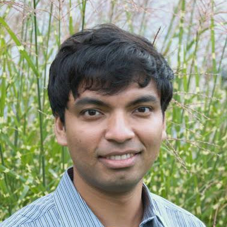

<link rel="stylesheet" type="text/css" href="css/bootstrap.min.css">
<link rel="stylesheet" type="text/css" href="css/main.css?1" media="screen,projection">

# Invited Talk: Inferring 3D shapes from image collections 

  

    
    

      <a href="https://people.cs.umass.edu/~smaji/" target="_blank">Subhransu Maji</a> 
      UMass Amherst
    

  

    
  

    This talk will describe some of our recent work on inferring 3D shapes from image collections. Much of this is motivated by the fact that supervision in the form of images (e.g., silhouettes, depth maps, part labels) are easier to acquire than 3D data. We show that by combining differentiable rendering pipelines with deep 3D generative models one can infer the underlying distribution of 3D shapes from image collections. I’ll highlight this in two applications 1) inferring the underlying 3D shape distribution from a collection of images (e.g., what shapes are chairs given a catalogue of chair photographs) assuming a reasonable prior over the viewpoints, and 2) inferring a 3D shape of an object from sparse set of views in the presence of viewpoint and projection noise. In both cases the rendering pipeline is a differentiable module which can be combined with deep generative model (e.g., GAN or deep shape prior) allowing inference via back-propagation machinery.
  

## Video

<iframe src="https://www.youtube.com/embed/QDY2mVm211U" 
    width="560" 
    height="315"
    frameborder="0" 
    allowfullscreen>
</iframe>

[back](https://anucvml.github.io/ddn-cvprw2020/#program)
